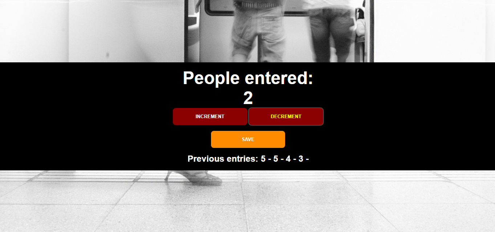
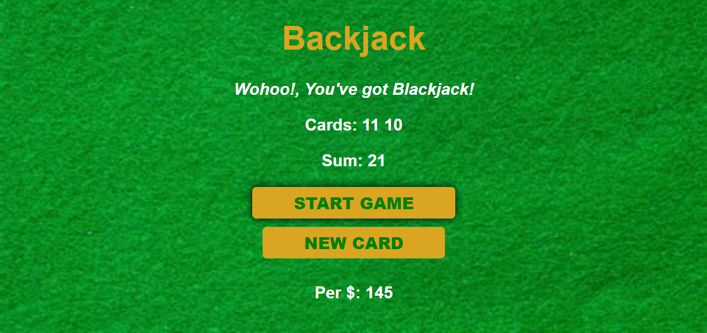
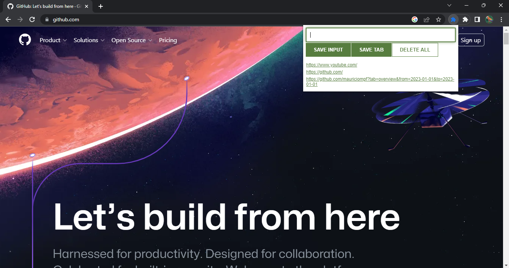

# Three Projects Using Javascript

Javascript learning from [freeCodeCamp.org](https://www.freecodecamp.org/) | [Javascript Programming - Full Course](https://youtu.be/jS4aFq5-91M)

In this course, I intend to understand the fundamentals of the javascript language by creating interactive websites.

## Passenger Counter

## BlackJack Game

## Chrome Extension

